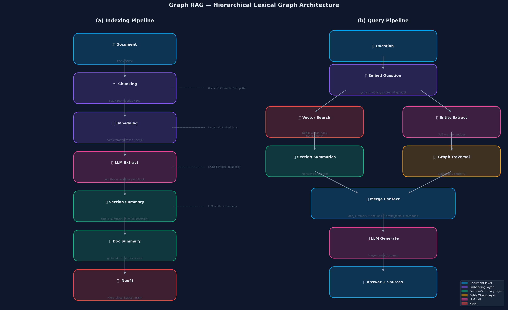
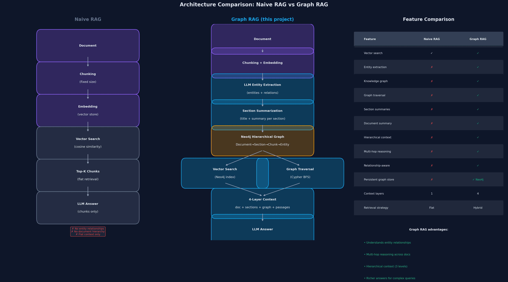
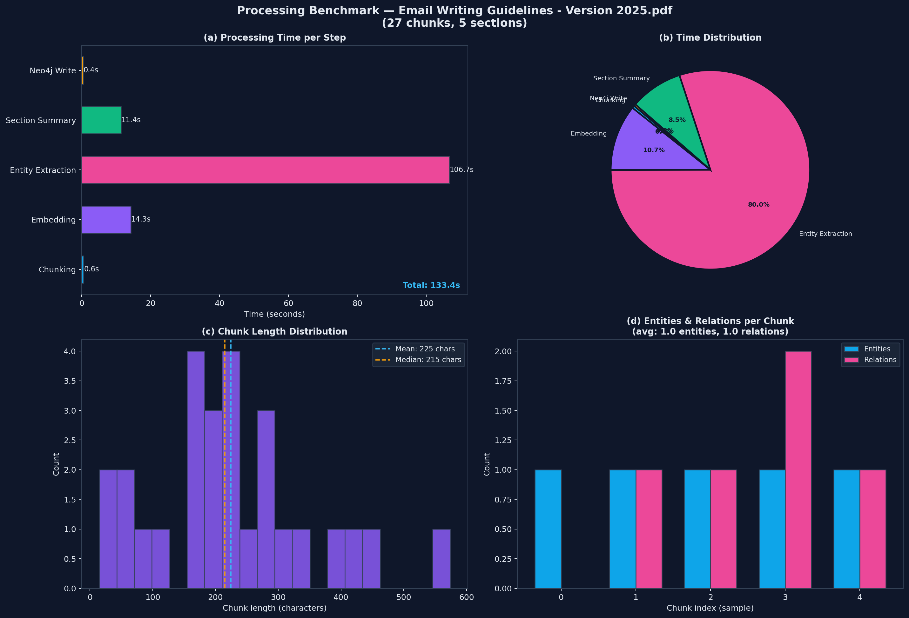
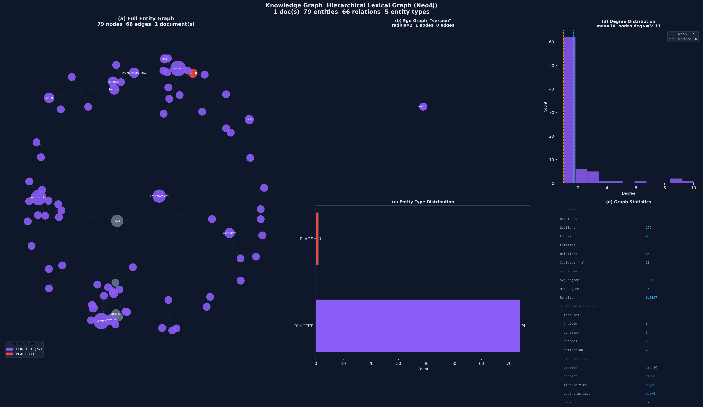
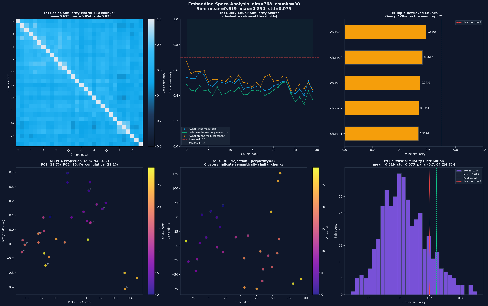

# Graph RAG — Hierarchical Lexical Graph

He thong hoi dap tai lieu thong minh — ban upload file PDF/DOCX, dat cau hoi bang ngon ngu tu nhien, he thong tim kiem va tra loi dua tren noi dung tai lieu do.

Diem khac biet so voi chatbot thong thuong: he thong khong chi tim doan van giong cau hoi, ma con **hieu quan he giua cac khai niem** trong tai lieu thong qua Knowledge Graph.



**(a) Indexing — khi upload file:**
Tai lieu duoc doc va cat thanh cac doan nho (chunks, ~800 ky tu moi doan). Moi doan duoc chuyen thanh vector so (embedding) de may tinh co the so sanh do tuong dong. Sau do, AI doc tung nhom doan va tu dong rut trich ra cac thuc the (nguoi, to chuc, khai niem, ky nang...) cung quan he giua chung. Toan bo duoc luu vao Neo4j duoi dang do thi phan cap: Document -> Section -> Chunk -> Entity.

**(b) Querying — khi dat cau hoi:**
Cau hoi duoc chuyen thanh vector roi tim cac doan van tuong tu nhat (vector search). Dong thoi, AI nhan dien cac thuc the trong cau hoi va duyet do thi de tim cac quan he lien quan (graph traversal). Ket qua tu ca hai nguon duoc gop lai thanh context 4 tang roi dua cho LLM sinh cau tra loi cuoi cung.

---

## Tai sao can Graph RAG?

Hay tuong tuong ban co mot tai lieu ky thuat day 200 trang. Neu hoi *"Java lien quan den Spring Boot nhu the nao?"*, RAG thong thuong chi tim cac doan co chua tu "Java" hoac "Spring Boot" — nhung khong biet rang Spring Boot **phu thuoc vao** Java, hay Java **la nen tang cua** Spring Boot.

Graph RAG giai quyet dieu do:

| Loai cau hoi | RAG thuong | Graph RAG |
|---|---|---|
| "X la gi?" | Tot | Tot |
| "X va Y lien quan the nao?" | Kem | Tot (graph traversal) |
| "Tom tat toan bo tai lieu" | Kem | Tot (document summary) |
| "Nhung khai niem nao lien quan den X?" | Kem | Tot (multi-hop) |



**(Trai) Naive RAG** — quy trinh don gian: chia chunks -> embed -> tim chunks giong cau hoi -> dua cho LLM. Khong co graph, khong co hierarchy, chi co flat retrieval.

**(Giua) Graph RAG (du an nay)** — bo sung them: entity extraction (AI tu rut trich thuc the), section summarization (tom tat tung nhom doan), Neo4j Hierarchical Graph (luu ca vector lan graph trong 1 database), hybrid retrieval (ket hop vector search + Cypher graph traversal).

**(Phai) Feature table** — so sanh truc tiep 13 tieu chi. Cac o xanh la tinh nang Graph RAG co ma Naive RAG khong co: entity relationships, knowledge graph, graph traversal, section summaries, document summary, hierarchical context, multi-hop reasoning, relationship-aware retrieval. Context layers: 1 (Naive) vs 4 (Graph RAG).

---

## Kien truc do thi

Tai lieu duoc to chuc thanh 4 tang trong Neo4j:

```
(:Document {summary})              <- tom tat toan bo tai lieu
      | HAS_SECTION
      v
(:Section {title, summary})        <- nhom 6 chunks, co tieu de + tom tat
      --NEXT_SECTION--> (:Section)  <- lien ket tuan tu giua cac section
      | HAS_CHUNK
      v
(:Chunk {text, embedding})         <- doan van goc + vector 768 chieu
      --NEXT_CHUNK----> (:Chunk)    <- lien ket tuan tu giua cac chunk
      | MENTIONS
      v
(:Entity {name, type})             <- thuc the: PERSON/ORG/CONCEPT/SKILL/PLACE
      --RELATED_TO {relation}--> (:Entity)  <- quan he co nhan giua cac thuc the
```

Khi tra loi cau hoi, LLM nhan context tu ca 4 tang cung luc — nen tra loi tot ca cau hoi tong quan lan cau hoi chi tiet.

---

## Benchmark thuc te

Do tren file PDF 1,446 KB — Java Interview Guide (250+ cau hoi phong van):

| Buoc | Thoi gian | Ghi chu |
|------|-----------|---------|
| Chunking | 1.1s | Cat 936 chunks, avg 628 ky tu/chunk |
| Embedding batch | 17.8s | 936 chunks x 768 chieu, 1 lan goi duy nhat |
| LLM extract (156 sections) | ~6,220s | ~40s/section voi Ollama local |
| Doc summary | 6.6s | 1 LLM call tong hop toan bo |
| Neo4j write | ~11.2s | Ghi nodes + edges + vector index |
| **Tong** | **~104 phut** | Ollama local. Groq: ~5-7 phut |

Ket qua graph sau khi index:
- Chunks: 936 · Sections: 156 · LLM calls: 157
- Entities trung binh: 10.0/section · Relations: 9.2/section
- Tokens xu ly uoc tinh: ~117,750

> LLM extraction chiem ~99% thoi gian. Dung Groq (mien phi, co rate limit) nhanh hon Ollama local ~15-20 lan.



**(a) Bar chart thoi gian tung buoc** — thay ro LLM extraction la bottleneck chinh. Embedding va chunking gan nhu tuc thi so voi LLM.

**(b) Pie chart phan bo thoi gian** — truc quan hoa ti le: LLM chiem gan nhu toan bo banh.

**(c) LLM time per section** — thoi gian tung LLM call trong sample 5 sections. Moi call xu ly ~3,000 ky tu text va tra ve JSON chua entities + relations + title + summary. Trung binh ~40s/section voi Ollama, ~2-3s voi Groq.

**(d) Chunk length distribution** — histogram do dai cac chunks. Mean/Median/P10/P90 cho thay chunks kha dong deu, it outlier — chunking strategy hoat dong tot.

**(e) Entities & relations per section** — so thuc the va quan he LLM rut trich duoc tu moi section trong sample. Avg 10 entities va 9.2 relations/section, uoc tinh ~1,560 entities va ~1,435 relations cho toan bo tai lieu.

**(f) Summary table** — bang tong hop toan bo so lieu pipeline: file size, chunks, sections, LLM calls, tokens, timing tung buoc.

---

## Knowledge Graph



**(a) Full entity graph** — toan bo entities va relations duoc extract tu tai lieu. Node size ti le voi degree (so ket noi) — node to hon = thuc the quan trong hon, xuat hien nhieu hon. Mau sac phan biet loai entity: xanh duong = PERSON, xanh la = ORG, tim = CONCEPT, vang = SKILL, do = PLACE, xam = OTHER. Chi hien thi label cho top-20 nodes co degree cao nhat de tranh roi.

**(b) Ego graph** — zoom vao entity trung tam nhat (degree cao nhat), hien thi tat ca nodes trong ban kinh 2 buoc. Cac canh co nhan quan he cu the (vi du: "is_used_in", "extends", "implements"). Day la cach he thong "nhin thay" quan he khi tra loi cau hoi ve entity do.

**(c) Entity type distribution** — so luong tung loai entity. Tai lieu ky thuat thuong co nhieu CONCEPT va SKILL hon PERSON hay PLACE.

**(d) Degree distribution** — phan bo so ket noi cua cac nodes. Dang power-law (duoi dai ben phai) la binh thuong voi knowledge graph: phan lon entities it ket noi, mot so it hub nodes ket noi rat nhieu.

**(e) Stats table** — tong hop: so documents/sections/chunks/entities/relations, avg degree, graph density, top 5 relation types, top 5 entities theo degree.

---

## Embedding Space

Embedding la cach bieu dien text thanh vector so (768 chieu) de may tinh co the do do tuong dong. Hai doan van co nghia gan nhau -> vector gan nhau -> cosine similarity cao (gan 1.0). Hai doan hoan toan khac chu de -> cosine similarity thap (gan 0).



**(a) Cosine similarity matrix** — heatmap mau sac the hien do tuong dong giua tat ca cap chunks (0 = hoan toan khac, 1 = giong het). Duong cheo = 1.0 (chunk so voi chinh no). Off-diagonal mean ~0.56 cho thay cac chunks co do da dang tot. Neu mean qua cao (>0.9) nghia la tai lieu lap lai nhieu; qua thap (<0.3) nghia la tai lieu rat da dang chu de.

**(b) Query-chunk similarity** — diem cosine cua 3 cau hoi mau voi tung chunk. Duong dut do (0.7) la nguong "relevant", duong dut xam (0.5) la nguong "co the lien quan". Chunks vuot nguong 0.7 se duoc uu tien dua vao context khi tra loi.

**(c) Top-K retrieved chunks** — voi 1 cau hoi cu the, day la top-5 chunks duoc chon kem score chinh xac. Mau xanh >=0.7 (highly relevant), vang >=0.5 (relevant), do <0.5 (low confidence). Giup debug xem he thong dang retrieve dung khong.

**(d) PCA projection** — chieu 768 chieu xuong 2 chieu bang PCA (giu lai huong co variance lon nhat). Mau gradient theo chunk index (thu tu trong tai lieu). Cac chunks gan nhau trong khong gian 2D co embedding tuong tu nhau. PC1 va PC2 cho biet % thong tin duoc giu lai sau khi giam chieu.

**(e) t-SNE projection** — phuong phap giam chieu khac, tot hon PCA trong viec giu cau truc cuc bo. Cac cum (clusters) trong bieu do la cac nhom chunks co noi dung tuong tu nhau ve mat ngu nghia — du chung co the o cac trang khac nhau trong tai lieu.

**(f) Pairwise similarity distribution** — histogram toan bo cap chunks. Duong dut P90 cho biet 90% cap chunks co similarity thap hon gia tri do. Dung de chon nguong retrieval phu hop: neu dat threshold qua cao se miss nhieu chunks lien quan, qua thap se dua vao qua nhieu noise.

---

## Tech Stack

| Layer | Technology | Vai tro |
|-------|-----------|---------|
| Backend | FastAPI + Uvicorn | REST API, xu ly upload va query |
| Graph DB | Neo4j 5.11+ | Luu graph + vector index trong 1 database |
| LLM | Ollama / Groq / OpenAI / Anthropic | Extract entities, sinh summary, tra loi |
| Embedding | nomic-embed-text (dim=768) | Chuyen text thanh vector |
| Orchestration | LangChain | Abstraction layer cho LLM va embeddings |
| Frontend | Vanilla HTML/JS | Chat UI don gian |

Toan bo stack co the chay **hoan toan local va mien phi** voi Ollama.

---

## Cai dat

**1. Neo4j (Docker):**
```bash
docker run -d --name neo4j \
  -p 7474:7474 -p 7687:7687 \
  -e NEO4J_AUTH=neo4j/password \
  neo4j:5.20
```
Neo4j Browser: http://localhost:7474

**2. Python:**
```bash
python -m venv .venv
.venv\Scripts\activate       # Windows
source .venv/bin/activate    # Linux/Mac
pip install -r requirements.txt
```

**3. `.env`:**
```env
# LLM
LLM_PROVIDER=ollama
OLLAMA_MODEL=llama3.2

# Embeddings
EMBED_PROVIDER=ollama
OLLAMA_EMBED_MODEL=nomic-embed-text

# Neo4j
NEO4J_URI=bolt://localhost:7687
NEO4J_USER=neo4j
NEO4J_PASSWORD=password
```

Muon nhanh hon voi file lon, doi sang Groq (mien phi, can API key tai console.groq.com):
```env
LLM_PROVIDER=groq
GROQ_MODEL=llama-3.1-8b-instant
GROQ_API_KEY=your_key_here
```

**4. Chay:**
```bash
.venv\Scripts\uvicorn.exe app.main:app --host 127.0.0.1 --port 8000
```

Mo `ui.html` trong browser. API docs: http://127.0.0.1:8000/docs

---

## API

| Method | Endpoint | Mo ta |
|--------|----------|-------|
| `POST` | `/api/upload` | Upload + index tai lieu vao Neo4j |
| `POST` | `/api/query` | Dat cau hoi, nhan cau tra loi + sources |
| `GET` | `/api/files` | Danh sach tai lieu da index |
| `DELETE` | `/api/files/{filename}` | Xoa tai lieu khoi Neo4j + disk |
| `GET` | `/health` | Trang thai server + Neo4j connection |

---

## Cau truc du an

```
app/
  main.py                  # FastAPI app, khoi tao Neo4j indexes
  api/routes.py            # API endpoints
  core/
    config.py              # Doc settings tu .env
    document_loader.py     # PDF/DOCX -> danh sach chunks
    graph_builder.py       # Build Hierarchical Lexical Graph vao Neo4j
    neo4j_store.py         # Neo4j CRUD, vector search, graph traversal
    rag_chain.py           # Query pipeline (embed -> search -> graph -> LLM)
    providers.py           # Factory cho LLM va Embeddings
research/
  01_pipeline_diagram.py   # Ve so do pipeline
  02_timing_benchmark.py   # Do thoi gian thuc tung buoc
  03_graph_visualization.py # Visualize knowledge graph tu Neo4j
  04_embedding_similarity.py # Phan tich embedding space
  05_architecture_comparison.py # So sanh Naive RAG vs Graph RAG
  run_all.py               # Chay tat ca scripts
figures/                   # Hinh anh duoc sinh ra boi research/
requirements.txt
ui.html                    # Chat UI
```

---

## Research Scripts

Sau khi da upload it nhat 1 tai lieu va Neo4j dang chay:

```bash
python research/run_all.py
```

Sinh toan bo figures vao `figures/`:
- `01_pipeline.png` — so do indexing va query pipeline
- `02_timing.png` — benchmark thoi gian xu ly thuc te
- `03_graph.png` — visualize knowledge graph tu Neo4j
- `04_similarity.png` — phan tich embedding space va retrieval scores
- `05_comparison.png` — so sanh kien truc Naive RAG vs Graph RAG

---

## Gioi han

- Upload file lon voi Ollama local rat cham (~40s/section) — dung Groq/OpenAI de nhanh hon
- Entity resolution dung normalize co ban (lowercase + collapse whitespace), chua co fuzzy matching
- Chua co community detection (Leiden/Louvain) nhu Microsoft GraphRAG goc
- Neo4j vector index yeu cau Neo4j 5.11+

---

## Tham khao

- [From Local to Global: A Graph RAG Approach](https://arxiv.org/abs/2404.16130) — Microsoft Research, 2024
- [awslabs/graphrag-toolkit](https://github.com/awslabs/graphrag-toolkit) — Hierarchical Lexical Graph (Apache-2.0)
- [microsoft/graphrag](https://github.com/microsoft/graphrag) — Official Microsoft GraphRAG (MIT)

---

MIT License
